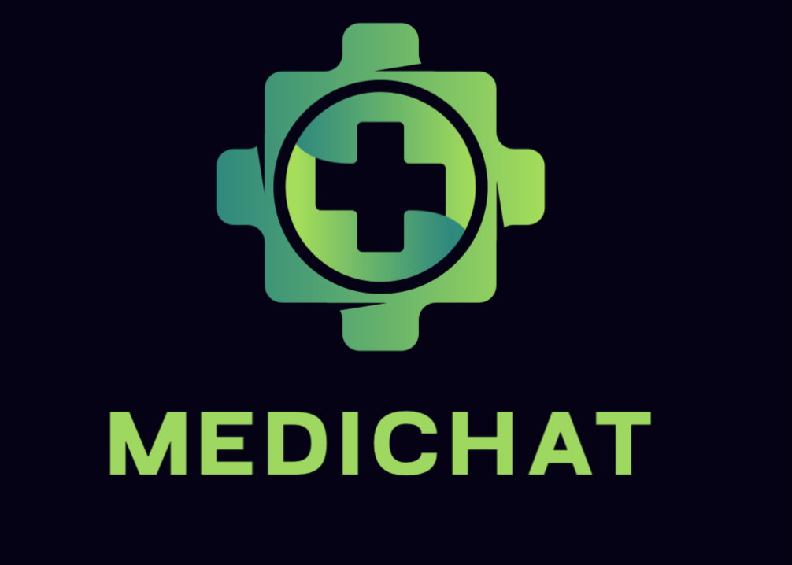

# MediChat-Agentic-Assistant



## Overview
**MediChat** is an intelligent, LLM-powered chatbot designed to provide real-time insights, personalized assistance, and streamlined workflows in the pharmaceutical and healthcare domains. It leverages **Retrieval-Augmented Generation (RAG)**, **OpenAI embeddings**, and **Llama-3.2-3b-Instruct** to help healthcare professionals retrieve actionable insights, drug alternatives, and safety measures efficiently.

## Features
- **RAG-based Question Answering**: Accurate, context-aware responses to medical queries.
- **Personalized Recommendations**: Suggests appropriate treatment options and drug alternatives.
- **Summarization**: Generates concise summaries of drug information, treatments, and medical procedures.
- **Web Search Integration**: Retrieves real-time data from the web for up-to-date information.

## Architecture
The system follows an **Agent-Based Architecture** that orchestrates the interaction between different modules based on the user's query.


### Key Components:
1. **Input UI**: Accepts user input and sends it to the Agent.
2. **Agent**: Decides which module to invoke (Summarizer, QnA, Recommender) based on the query’s intent.
3. **Vector Store**: Uses **ChromaDB** to store document embeddings and perform semantic search.
4. **Modules**:
   - **Web Search**: Fetches additional context and alternatives from the web using **DuckDuckGo**.
   - **RAG**: Combines document retrieval and LLM generation for question answering.
   - **Summarizer**: Provides concise summaries of relevant documents.
   - **Recommender**: Suggests drug alternatives and treatment recommendations.

## Installation

### Requirements
- Python 3.x
- Required Python libraries:
  - `LangChain`
  - `LangGraph`
  - `ChromaDB`
  - `Streamlit`
  - `DuckDuckGo search`
  - `OpenAI` (for embeddings)

### Setup Instructions

1. **Clone the repository**:
   ```bash
   git clone https://github.com/AnshulRanjan2004/MediChat-Agentic-Assistant.git
   cd MediChat-Agentic-Assistant
   ```

2. **Install the required dependencies**:
   ```bash
    pip install -r requirements.txt
   ```

3. **Run the application**:
    ```bash
    streamlit run app.py
    ```

## Modules

1. **RAG Application for Question Answering**
    - Utilizes LangChain to process and retrieve relevant documents, followed by generation of context-aware answers using the Llama-3.2-3b-Instruct model.
2. **Recommender**
    - Uses semantic search via OpenAI embeddings and ChromaDB to suggest personalized drug alternatives and treatment options.
3. **Alternatives Generator**
    - Integrates DuckDuckGo search to fetch real-time information about alternative treatments or drugs and generate suggestions.
4. **Summarizer**
    - Generates concise summaries of drug, treatment, or medical procedure information using custom prompts and LLM-based generation.
5. **Agent-Based Framework**
    - The Agent interprets the user query and routes it to the relevant module (e.g., Summarizer, QnA, Recommender) for processing.

## Usage
1. Open the Streamlit app interface.
2. Type a query (e.g., "What are the alternatives for aspirin?" or "Summarize drug interactions for X").
3. The system will process your query, retrieve the relevant data, and provide insights through the UI.

## Specifications
- **Language Model**: Llama-3.2-3b-Instruct running locally on LM Studio.
- **Backend**: LangChain, LangGraph, ChromaDB for vector storage and retrieval.
- **Web Search**: DuckDuckGo integration for real-time data.
- **Frontend**: Streamlit with custom sidebar and agent interactions.

## Demo
Watch the demo video to see the MediChat in action:

https://github.com/user-attachments/assets/6dcfc062-cea0-4fc0-8a97-7f04c1405f24

## Contributing
Feel free to fork the repository, raise issues, or contribute improvements via pull requests.
